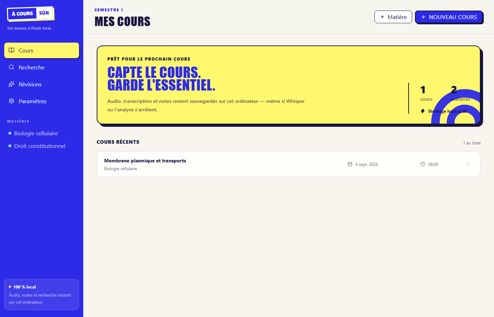

<p align="center">
  
</p>

<h1 align="center">À cours sûr</h1>

<p align="center">
  Enregistrez. Notez. Révisez.<br>
  Une application Windows locale et sobre, pensée pour les étudiants.
</p>

<p align="center">
  <a href="https://github.com/janjawish/a-cours-sur/releases/latest"></a>
  
  
  
  <a href="LICENSE"></a>
</p>

<p align="center">
  <a href="https://github.com/janjawish/a-cours-sur/releases/latest/download/ACoursSur-Setup-x64.exe"><strong>Télécharger pour Windows</strong></a>
  ·
  <a href="#utiliser-lapplication">Guide de démarrage</a>
  ·
  <a href="#développer-localement">Développement</a>
</p>



À cours sûr réunit l’audio, vos notes, le transcript et vos révisions dans un même cours. L’audio et la transcription restent sur votre ordinateur. Gemini est facultatif et n’intervient qu’après le cours.

## Installer en quelques minutes

### 1. Installer l’application

Téléchargez puis lancez **[ACoursSur-Setup-x64.exe](https://github.com/janjawish/a-cours-sur/releases/latest/download/ACoursSur-Setup-x64.exe)**. Un paquet MSI est également disponible sur la [page des versions](https://github.com/janjawish/a-cours-sur/releases/latest).

> La V1 n’est pas encore signée avec un certificat Windows. SmartScreen peut donc afficher un avertissement. Vérifiez que le fichier vient bien de ce dépôt et, si nécessaire, choisissez **Informations complémentaires → Exécuter quand même**. Les empreintes SHA-256 sont jointes à chaque version.

### 2. Activer la transcription locale

Dans PowerShell, exécutez ces trois commandes :

```powershell
$script = "$env:TEMP\install-whisper.ps1"
Invoke-WebRequest "https://github.com/janjawish/a-cours-sur/releases/latest/download/install-whisper.ps1" -OutFile $script
powershell -NoProfile -ExecutionPolicy Bypass -File $script
```

Le script télécharge uniquement la distribution Windows x64 de la [version officielle de whisper.cpp](https://github.com/ggml-org/whisper.cpp/releases/latest), l’installe dans votre dossier utilisateur et configure `WHISPER_CPP_BIN`. Relancez l’application après son exécution.

Dans **Paramètres → Whisper local**, choisissez ensuite un profil et cliquez sur **Télécharger** :

| Profil | Modèle | Usage conseillé |
|---|---:|---|
| Rapide | tiny · ~75 Mo | transcription pendant le cours |
| Équilibré | base · ~142 Mo | meilleur compromis |
| Précis | small · ~466 Mo | passe finale après le cours |

## Utiliser l’application

1. Dans **Cours**, créez un semestre, une matière, puis un cours.
2. Ouvrez le cours et cliquez sur **Démarrer l’enregistrement**. Autorisez le microphone si Windows le demande.
3. Écrivez vos notes pendant que le transcript se complète. Tout est sauvegardé progressivement.
4. Ajoutez un marqueur au bon moment avec les raccourcis :

   - `Ctrl+1` — Important
   - `Ctrl+2` — Je n’ai pas compris
   - `Ctrl+3` — À revoir
   - `Ctrl+4` — Examen

5. Arrêtez l’enregistrement. Relisez le transcript en cliquant sur un passage pour revenir au bon moment dans l’audio.
6. Retrouvez n’importe quel passage depuis **Recherche**. Le résultat ouvre directement le cours au timestamp concerné.
7. Facultatif : ajoutez votre clé dans **Paramètres → Analyse Gemini**, puis générez résumé, fiche, flashcards et quiz depuis l’onglet **Révision** du cours.

Une erreur de Whisper ou d’IA n’arrête jamais l’enregistrement. Sans IA, vous pouvez toujours enregistrer, transcrire, écouter, noter et rechercher.

## Ce que contient la V1

- organisation `Semestre → Matière → Cours` ;
- audio WAV local écrit progressivement sur disque ;
- transcription locale quasi temps réel et passe finale avec `whisper.cpp` ;
- notes autosauvegardées et marqueurs horodatés ;
- lecteur audio synchronisé au transcript ;
- recherche plein texte locale avec SQLite FTS5 ;
- analyses structurées via Gemini avec votre propre clé ;
- séparation claire entre les propos explicites du professeur et les suggestions de l’IA ;
- fonctionnement hors ligne pour toutes les fonctions essentielles.

Le contrat `AIProvider` comprend `GeminiProvider` et `CodexProvider`. Gemini est fonctionnel. Codex est volontairement laissé désactivé tant qu’une intégration officielle, minimale et correctement isolée n’est pas finalisée : aucune récupération manuelle de jeton ChatGPT ou Codex n’est effectuée.

## Confidentialité

Par défaut, l’audio, les notes, les transcripts, les marqueurs et l’index de recherche restent dans le dossier de données local de l’application. La clé Gemini est conservée dans le **Gestionnaire d’identifiants Windows**, jamais dans SQLite, `.env` ou les logs.

Lors d’une analyse Gemini, seuls le titre, le transcript, les notes et les marqueurs du cours sélectionné sont envoyés. L’audio n’est jamais envoyé.

## Développer localement

### Prérequis

- Windows 10 ou 11 avec WebView2 ;
- [Node.js 20+](https://nodejs.org/) ;
- [Rust stable](https://rustup.rs/) ;
- Visual Studio 2022 Build Tools avec **Desktop development with C++**.

### Lancer le projet

```powershell
git clone https://github.com/janjawish/a-cours-sur.git
cd a-cours-sur
npm install
npm run setup:whisper
npm run tauri dev
```

Le script Whisper est optionnel pour travailler uniquement sur l’interface. Les modèles se téléchargent depuis les paramètres de l’application.

### Vérifier et construire

```powershell
npm run check
npm run build
cargo test --manifest-path src-tauri/Cargo.toml
npm run tauri build
```

Les installateurs sont générés dans `src-tauri\target\release\bundle`.

## Architecture

```text
src/                         React + TypeScript + Tailwind CSS
├─ components/               écrans et composants d’interface
├─ hooks/useRecorder.ts      capture micro et flux d’enregistrement
└─ lib/                      commandes Tauri et providers IA

src-tauri/src/               cœur natif Rust
├─ audio.rs                  écriture WAV résiliente
├─ db.rs                     SQLite, migrations et FTS5
├─ whisper.rs                modèles et exécution whisper.cpp
└─ ai.rs                     coffre Windows et appel Gemini
```

Les données de développement et les données personnelles (`*.sqlite`, audio, vidéos, modèles et secrets) sont exclues de Git.

## Feuille de route

- intégrer proprement les binaires Whisper à l’installateur ;
- importer et extraire le texte des PDF et PPTX ;
- traiter les fichiers audio et vidéo existants ;
- activer `CodexProvider` via un mécanisme officiel OpenAI ;
- signer les installateurs Windows.

## Dépannage

- **Fenêtre blanche** : installez la dernière version. Depuis `v0.1.1`, l’application utilise le rendu logiciel WARP lorsque WebView2 ne parvient pas à démarrer le processus GPU.
- **Whisper n’est pas détecté** : relancez l’application après le script, puis ouvrez **Paramètres → Whisper local**. Le chemin d’installation standard est également détecté sans variable d’environnement.

## Contribuer

Les issues et pull requests sont bienvenues. Consultez [CONTRIBUTING.md](CONTRIBUTING.md) avant de proposer une modification. Gardez la V1 Windows uniquement, simple et compilable ; ne commitez jamais de clé API, d’audio, de base SQLite ou de modèle Whisper.

## Licence

Distribué sous licence [MIT](LICENSE).
